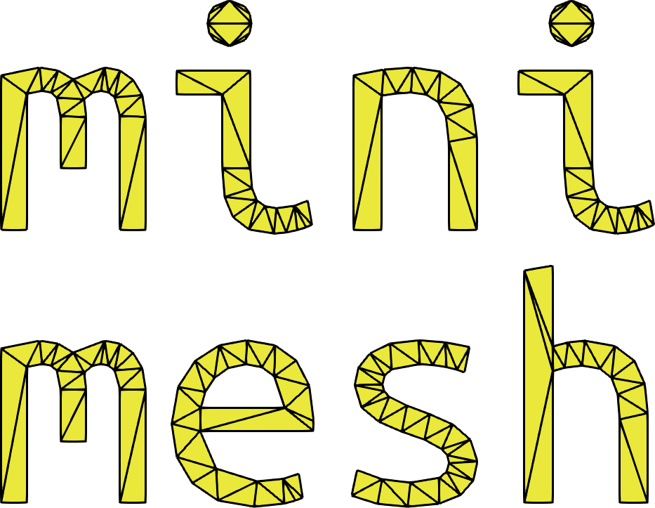
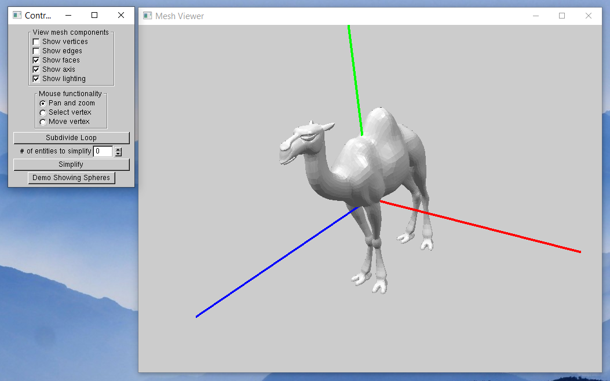
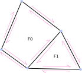

# minimesh  

<div style="text-align:center"></img></div>

Half edge data structure based framework for surface mesh modification. 

>  `minimesh` only supports manifold meshes (with or without boundary) at the moment.

An optional graphical user interface for viewing meshes
and interacting with them is also provided.

<div style="text-align:center"></img></div>

`minimesh` can be used for teaching or even prototyping geometry processing algorithms, The core part of the code is located in the files `src/minimesh/core/mohe/mesh_connectiviy.[ch]pp`, which represents a surface mesh via the half edge data structure.

<div style="text-align:center"></img></div>

Examples of mesh modification operations such as `edge flip` are provided in `src/minimesh/core/mohe/mesh_modifier.[ch]pp`.

<div style="text-align:center">
</img>
</div>

## Related software
- CGAL's [`Surface_mesh`](https://doc.cgal.org/latest/Surface_mesh/index.html) class (The easy-to-use one is with the icon of a fish. Not to be mistaken with the notorious CGAL package [`Polyhedron_3`](https://doc.cgal.org/latest/Polyhedron/index.html#Chapter_3D_Polyhedral_Surfaces) which has the icon of a hammer head shark).
- [CMU 462 computer graphics, mesh editting assignment](http://462cmu.github.io/asst2_meshedit/)
- [Cartel](http://www.cs.ubc.ca/labs/imager/tr/2014/CartelModeling/Cartel_website/)
- Half edge data structures by Yotam Gingold in [python](https://github.com/yig/trimesh) or [c++](https://github.com/yig/halfedge).
- [OpenMesh](https://www.openmesh.org/) ([Sketcher](https://github.com/HasKha/Sketcher) uses OpenMesh and also offers interactive visualization).

## Projects using minimesh

- [UBC CPSC 524, Computer Graphics: Modeling](https://www.cs.ubc.ca/~sheffa/dgp/)

## Building the code

Install cmake. Then open a CMD window if you are on windows, and a
bash window in Linux. Make sure that the cmake executable is on you
PATH environment variable.

Then change directory into the build-opt, or build-dbg folders
depending on whether you want to build the code in debug or release
mode. Then copy the relevant command from the cmake-examples.txt.

You can build the code via the command line, or within visual studio.
The needed commands for command line are also provided in
cmake-examples.txt.

Before running the executable, also build the target COPY_DLLS on
windows.

### NOTE:

If you are using visual studio, place the file
debugger/eigen/msvc/eigen.natvis in \path\to\msvc\Community\Common7\Packages\Debugger\Visualizers. Where \path\to\msvc is the location of MSVC on your hard drive. On my machine, for example, it is C:\Program Files (x86)\Microsoft Visual Studio\2017. This will help you see the eigen matrices easier in the debugger.

If you are using GDB, follow the instruction at top of the file debugger/eigen/gdb/printers.py.

For mac, you also need to run
```
- brew install glui
```
Then find get the directory in which glui is installed via
```
- brew info glui
```
And then copy it to the respective place in cmake-examples.txt for the value of the GLUI_DIR variable. I have not been able to build glui locally yet sadly.

## Getting started

Start with minimesh/cli/main.cpp, and then work your way through mesh_connectivity.[ch]pp, mesh_io.[ch]pp.

The code is documented with descriptive comments in the header files.

## Code structure

```
- src/minimesh/

  The actual C++ codebase, divided to three main part.

  - core/

    This is the core part of the library. It will be built into the library, minimeshcore.

    - util:
      Some basic utility code to do minor tasks.

    - mohe/
      Manifold oriented half edge data structure.
      - mesh_connectivity.[ch]pp:
        A class to build and store half-edge data structure.
      - mesh_io.[ch]pp
        A class to read and write mesh file formats.

  - cli/

    Short for command-line interface. This folder has a main() function, and will be built into an executable which links against minimeshcore.

  - viz/
     
     A small library containing functionality that a gui application can use.

  - gui/

    The executable main file for the gui.

- build-opt/, build-dbg/

  Empty folders where you can run cmake inside. One for the optimized build and the other for debug builds.

- cmake/

  CMake scripts.

- debugger/

  Tools for vewing Eigen matrices nicely in the debugger.

- third-party/

  Third party dependencies compiled for win64 and Linux with GCC.

- mesh/

  A few example meshes to test your algorithms on.

- .vscode/

  Visual studio code config files, in case you decide to use it.

```